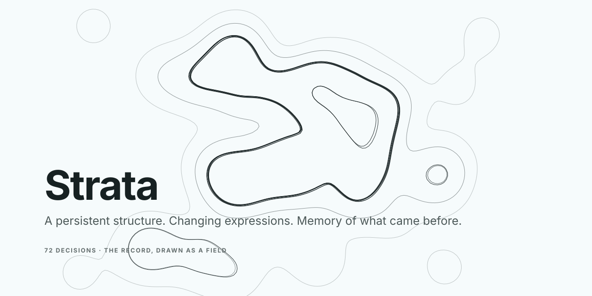

# Strata

<picture>
  <source media="(prefers-color-scheme: dark)" srcset="public/hero-dark.svg">
  
</picture>

**A persistent design decision system for humans and agents.**

> **When components become disposable, decisions become the architecture.**

While a stylesheet was hand-made, it was where the thinking lived. An artifact
that can be produced again from something else carries the *output* of the
thinking, which cannot be read backwards — so the decision is either held
somewhere durable or it is gone the next time anything regenerates.

Strata is that somewhere: a small, inspectable record of what a product has
decided — its meaning, behavior, expression, structure, reasons and exceptions.
CSS, tokens, components, Figma libraries and generated screens are **projections**
of that record. They can be regenerated, replaced or discarded without losing
the decisions that produced them.

**The record is the decision. Everything else is a projection.**

---

## The published site

[](https://prometheus-000.github.io/strata/lab.html)

<details>
<summary>What the Theme Lab shows, as text</summary>

```
DESCRIBE IT  [ neon diner, 3am, rain on the glass ]  Compile · or sample an image
             Obsidian · Gallery · Ember · Ultraviolet · Meadow · Glacier

HUE        250°        NEIGHBORS   temperature 0.40 · Reroll
CHROMA     0.000         Aa 248°·c0.02   Aa 231°·c0.03   Aa 242°·c0.02   Aa 269°·c0.02
LIGHTNESS  +1.00
WARMTH     0.00        ink on page      15.7:1   AA
ENERGY     0.35        muted on page     7.1:1   AA
DENSITY    ×1.00       faint on page     5.1:1   AA
GROUND     Dark|Light  label on accent  12.9:1   AA

{ "hue": 250, "chroma": 0, "warmth": 0, "energy": 0.35,
  "density": 1, "appearance": "light", "lightness": 1 }

Mission telemetry — every surface here derives from the seeds on the left;
drag, describe, sample or wander, and the system recomputes itself.
```

</details>

<sup>**[▶ Open the Theme Lab](https://prometheus-000.github.io/strata/lab.html)** — drag a seed and watch every token, contrast pair and specimen recompute.</sup>

| Page | What it is |
| --- | --- |
| **[Theme Lab](https://prometheus-000.github.io/strata/lab.html)** | Seven seeds — hue, chroma, lightness, warmth, energy, density, appearance — derive every colour, surface, stroke, radius and easing in OKLCH. Live AA contrast on every pair. |
| **[The hub](https://prometheus-000.github.io/strata/)** | The showcase, the record, the grammar and the reference in one place. |
| **[Personalize](https://prometheus-000.github.io/strata/personalize.html)** | The same engine pointed at one person's taste. |
| **[Malleable](https://prometheus-000.github.io/strata/malleable.html)** | Change the real page by hand — drag a corner, move a region, pick a prop. Each is a decision on the record. |
| **[Identity](https://prometheus-000.github.io/strata/identity.html)** | The record drawn as a field. Every decision is a bump; the favicon is this at 32px. |
| **[Sky](https://prometheus-000.github.io/strata/sky.html)** | The same record with depth — one continuous zoom from a galaxy to a single decision. |

The static site shows what was decided; it cannot write. `npm run dev` writes through.

---

## How it works

One record. Every hand — a pointer, a terminal, an agent's shell, an MCP
call — goes through the same door and names two hands: who *chose*, and whose
hand *wrote*. Everything downstream is derived and can be produced again.

<picture>
  <source media="(prefers-color-scheme: dark)" srcset="public/diagram-loop-dark.svg">
  
</picture>

<details>
<summary>The same loop as text</summary>

```
                       HUMAN INTENT
                            │
                            ▼
                 ┌────────────────────┐
                 │  DECISION SUBSTRATE │
                 │                    │
                 │  decisions         │   .strata/decisions.jsonl
                 │  context           │   history, current, pending
                 │  grammar           │   grammar/rules.json
                 │  provenance        │   decided · written · at · via · because
                 │  precedent         │   strata precedent
                 │  evidence          │   strata explain · strata check
                 └─────────┬──────────┘
                           │
             ┌─────────────┼──────────────┐
             │             │              │
             ▼             ▼              ▼
          Agent A       Agent B        Agent C
          generate      evaluate       explore
             │             │              │
             └─────────────┼──────────────┘
                           ▼
                       DECISIONS          decide(request, { decided, written, via })
                           │
                           ▼
                 ┌────────────────────┐
                 │    PROJECTIONS     │
                 │                    │
                 │ React              │   src/theme/ThemeContext.tsx
                 │ CSS                │   src/tokens/semantic.css
                 │ tokens.json        │   src/tokens/tokens.json
                 │ the override store │   strata-malleable/.malleable/overrides.json
                 │ the JSX itself     │   a move is a diff
                 │ Figma · other      │   not built; see the end
                 └─────────┬──────────┘
                           │
                           ▼
                       REAL USE
                           │
                           ▼
                    OBSERVATIONS          consumers · contrast · convergence
                           │
                           ▼
                      PRECEDENT           "37 instances, 3 hands, converged on 12px"
                           │
                           └──────────────► substrate
```

</details>

---

## What can fail a build

**A build fails only on a mechanical truth about the artifact** — the record
parses, the projections match it, every fallback chain ends, every `var()`
resolves. Four rules out of thirty-six.

Everything else — including contrast, including this product's own taste — is
**reported, never refused**. Nothing runs while someone is designing: no hook,
no lint, no cost mark mid-drag. A design in progress fails any check by
definition, so evaluation happens at `ready`, at `check`, and when asked.

<picture>
  <source media="(prefers-color-scheme: dark)" srcset="public/diagram-authority-dark.svg">
  
</picture>

<details>
<summary>The same arrangement as text</summary>

```
                INVARIANT
                   │
              enforce
                   │
              ─────────
                   │
              everything
                 else
                   │
                observe
                   │
                record
                   │
               evaluate
                   │
              learn/promote
```

</details>

**Designers define the UX.** The reviewer makes the code fit, and never moves
anything back.

---

## Start here

**Which door is yours:**

| You are | Go to | About |
| --- | --- | --- |
| **A designer, just looking** | the [Theme Lab](https://prometheus-000.github.io/strata/lab.html), then [GRAMMAR.md](GRAMMAR.md) | 10 minutes |
| **Putting it in a repo** | [ADOPTING.md](ADOPTING.md) | 15 minutes |
| **Learning it properly** | [GETTING_STARTED.md](GETTING_STARTED.md) | an hour with a real record |
| **An agent** | [docs/agents.md](docs/agents.md) | the contract, and what is not decidable |

**Put it in your repository** — an existing product or an empty directory; both
are ordinary, and `init` asks three questions with defaults:

```bash
npm install --save-dev strata-design
npx strata init
npx strata check
```

**Or read this repository instead** — it is itself a Strata product:

```bash
git clone https://github.com/Prometheus-000/strata.git && cd strata
npm install && npm test
npx strata check && npm run dev
```

---

## Carrying a voice between products

A voice here is text. This repository's is nine rules, each with the reason it
exists, the 19KB of prose those rules cite, and seven numbers:

```json
{"hue": 250, "chroma": 0, "warmth": 0, "energy": 0.35, "density": 1, "appearance": "light", "lightness": 1}
```

Every colour, surface, stroke, radius and easing derives from those seven. So a
designer's taste moves between projects without the components it was expressed
in, and without a version to keep in step:

```bash
npx strata init --voice ../my-other-product
npx strata init --voice https://github.com/you/your-voice
```

The rules and the prose are frame, so `init` writes them. The seeds are a
decision, so it makes none — it reports the ones it found and prints the command
that adopts them. A product started this way holds every invariant, and `strata
check` reads the carried rules as that product's own taste rather than the
system's.

---

## What a decision looks like

Ask the record why something is the way it is, and it answers in four blocks —
what was decided, what the record knew, what the evaluators found, and what
followed:

```
$ npx strata explain token:--shadow-color

DECISION
──────────────
Token: --shadow-color
Action: cut
Decided by: human prometheus-000
Written by: agent claude-code
Reason: Lines, not shadows. The reference grammar — the portfolio and Visionary
alike — draws every level with a 1px rule and an alpha wash …

EVIDENCE
──────────────
consumers: 0  (token.usage)
duplicate visual role: no  (token.duplicate-role)

CONSEQUENCE
──────────────
fallback → transparent
```

A cut token does not disappear — it *collapses* to a declared fallback, with the
decision emitted beside it, so the fourteen sites that say `var(--shadow-color)`
keep working:

```css
--shadow-color: transparent; /* cut by human prometheus-000: Lines, not shadows. … */
```

---

## The reference

| Page | What it covers |
| --- | --- |
| [**Thesis**](docs/thesis.md) | What broke the library model, and what replaces it |
| [**Principles**](docs/principles.md) | The eight the whole system rests on |
| [**Architecture**](docs/architecture.md) | How the record, the hands and the projections are arranged |
| [**The Decision Model**](docs/decisions.md) | One type, eight kinds — and how precedent is computed |
| [**Agent Model**](docs/agents.md) | What Strata guarantees, what a harness honours, what is not decidable |
| [**Governance**](docs/governance.md) | Invariant · policy · preference · knowledge · precedent, and their authority |
| [**Projections**](docs/projections.md) | Every derived file, and what it is derived from |
| [**Examples**](docs/examples.md) | A token cut, a region moved, a convergence promoted, a handoff |
| [**CLI**](docs/cli.md) | Every command, and the two hands each one names |
| [**What's not built**](docs/not-built.md) | Stated so the next reader inherits the test and not the verdict |
| [**GRAMMAR.md**](GRAMMAR.md) | The rules with their reasons — and this product's own taste, marked as such |

The record this repository runs on is 72 decisions, 34 of them imported. That is
a record of a vocabulary and a few sessions, not yet a product designed over
months — [docs/not-built.md](docs/not-built.md) is the rest of that list.

---

## Where it comes from

Strata is the design-system instance of a thesis that first held in a
generative media platform: *the user's prose is the record; everything derived
from it can be made again.* A prompt is a compilation target, not something a
person writes; a stored artefact is worth nothing to the next model, but
intent recompiles. The same argument, applied to a stylesheet, produces seven
seeds and an engine. Applied to a review process, it produces an evaluator
that reports instead of failing. Applied to a layout, it produces a drag that
lands, and a reviewer who adapts the code to it. Applied to all of them at
once, it produces one record, and everything else as a projection.
