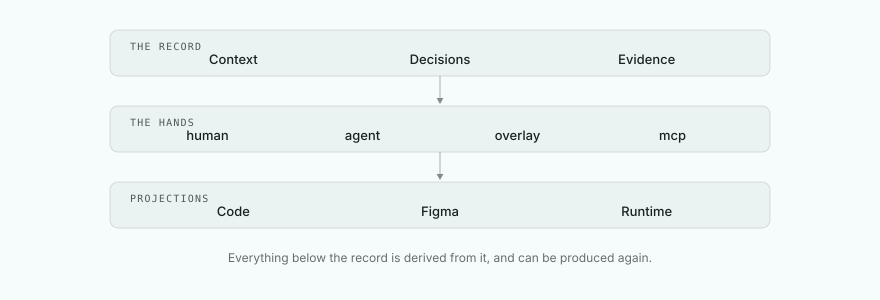
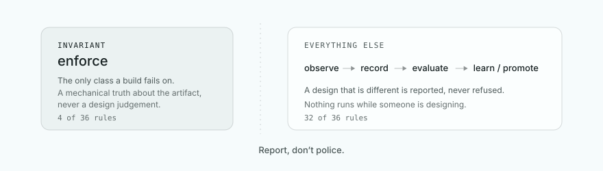
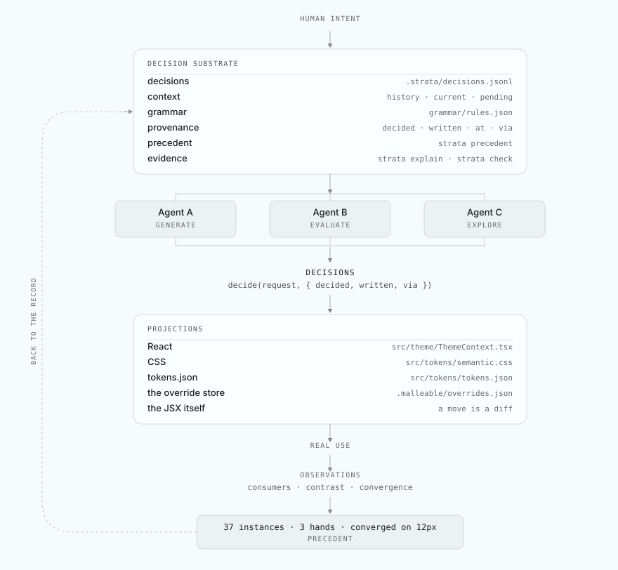

# Architecture

<picture>
  <source media="(prefers-color-scheme: dark)" srcset="../public/diagram-architecture-dark.svg">
  
</picture>

<details>
<summary>The same arrangement as text</summary>

```
                    Decision Substrate
                           │
          ┌────────────────┼───────────────┐
          │                │               │
       Context          Decisions       Evidence
          │                │               │
          └────────────────┼───────────────┘
                           │
                        Agents
                           │
                     Projections
                           │
          ┌────────────────┼───────────────┐
          ↓                ↓               ↓
        Code             Figma           Runtime
```

</details>

The governing arrangement is one line: report, don't police.

<picture>
  <source media="(prefers-color-scheme: dark)" srcset="../public/diagram-authority-dark.svg">
  
</picture>

<details>
<summary>The same arrangement as text</summary>

```
                INVARIANT
                   │
              enforce
                   │
              ─────────
                   │
              everything
                 else
                   │
                observe
                   │
                record
                   │
               evaluate
                   │
              learn/promote
```

</details>

And the loop the whole thing runs in:

<picture>
  <source media="(prefers-color-scheme: dark)" srcset="../public/diagram-loop-dark.svg">
  
</picture>

<details>
<summary>The same loop as text</summary>

```
                       HUMAN INTENT
                            │
                            ▼
                 ┌────────────────────┐
                 │  DECISION SUBSTRATE │
                 │                    │
                 │  decisions         │   .strata/decisions.jsonl
                 │  context           │   history, current, pending
                 │  grammar           │   grammar/rules.json
                 │  provenance        │   decided · written · at · via · because
                 │  precedent         │   strata precedent
                 │  evidence          │   strata explain · strata check
                 └─────────┬──────────┘
                           │
             ┌─────────────┼──────────────┐
             │             │              │
             ▼             ▼              ▼
          Agent A       Agent B        Agent C
          generate      evaluate       explore
             │             │              │
             └─────────────┼──────────────┘
                           ▼
                       DECISIONS          decide(request, { decided, written, via })
                           │
                           ▼
                 ┌────────────────────┐
                 │    PROJECTIONS     │
                 │                    │
                 │ React              │   src/theme/ThemeContext.tsx
                 │ CSS                │   src/tokens/semantic.css
                 │ tokens.json        │   src/tokens/tokens.json
                 │ the override store │   strata-malleable/.malleable/overrides.json
                 │ the JSX itself     │   a move is a diff
                 │ Figma · other      │   not built; see the end
                 └─────────┬──────────┘
                           │
                           ▼
                       REAL USE
                           │
                           ▼
                    OBSERVATIONS          consumers · contrast · convergence
                           │
                           ▼
                      PRECEDENT           "37 instances, 3 hands, converged on 12px"
                           │
                           └──────────────► substrate
```

</details>

The code is arranged the same way. `substrate/` is a package with no
dependencies and no framework: the Decision type, the log, `decide()`,
projections, precedent, the grammar, evaluators, `check`, skills. It imports
nothing from the layers above it. The theme engine (`src/theme/`) and the
malleable layer (`strata-malleable/`) are projections: each registers the
handlers for the kinds it applies, the files it derives from the record, the
evaluators that speak for it, and the state a skill can read. `bin/strata.mjs`
is the one CLI, and it mounts both.
